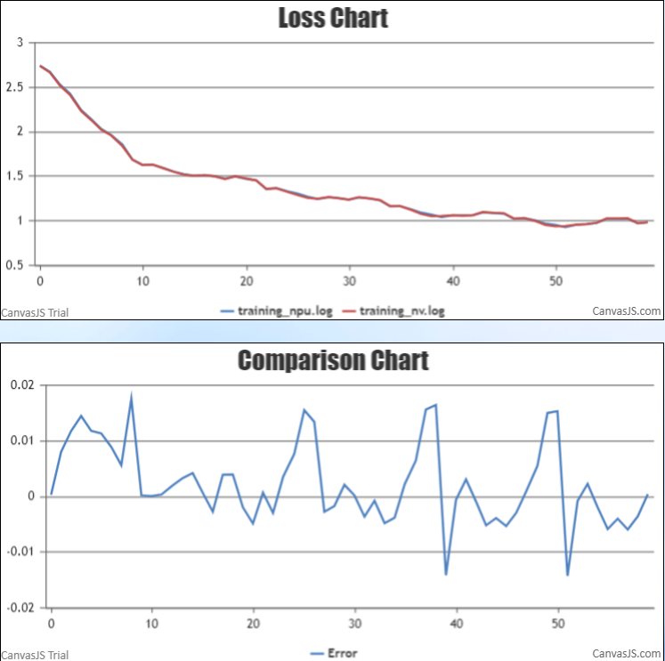

<div align="center">
<h1>
  星辰语义大模型-TeleChat
</h1>
</div>

<p align="center">
🤗 <a href="https://huggingface.co/Tele-AI/Telechat-7B" target="_blank">Hugging Face</a> • 🏔 <a href="https://gitee.com/mindspore/mindformers/tree/dev/research/telechat" target="_blank">MindSpore</a> • 🐾 <a href="https://gitee.com/Tele-AI/tele-chat" target="_blank">gitee</a>️ • 💬 <a href="https://github.com/Tele-AI/Telechat/blob/master/images/wechat.jpg" target="_blank">WeChat</a>
</p>

<p align="center">
 <a href="https://arxiv.org/abs/2401.03804" target="_blank"> Tech Report </a> 
</p>

# 目录
- [模型介绍](#模型介绍)
- [数据开源](#数据开源)  
- [效果评测](#效果评测)
- [模型推理和部署](#模型推理和部署)
- [模型微调](#模型微调)
- [模型量化](#模型量化)
- [国产化适配](#国产化适配)
- [声明、协议、引用](#声明协议引用)

# 最新动态
- 2024.1月底开源12B版本模型（待开放）
- 2024.1.11 开源1T中文数据集
- 2024.1.10 开源7B版本chat模型及其量化版本

# 模型介绍
### 星辰语义大模型-TeleChat
- 星辰语义大模型TeleChat是由中电信人工智能科技有限公司研发训练的大语言模型，采用1.5万亿 Tokens中英文高质量语料进行训练。
- 本次开源了对话模型**TeleChat-7B-bot**，以及其`huggingface`格式的权重文件。此外，我们还开源了7B模型的int8和int4量化版本。

### 模型结构

我们采用标准的 `Decoder-only` 结构设计了 **TeleChat** 模型，并在模型维度做了如下的一些改进：

- **位置编码**：我们使用 [Rotary Embedding](https://arxiv.org/pdf/2104.09864.pdf) 的位置编码方法，该方法将相对位置信息依赖集成到 self-attention 中，并且具有较好的位置外推性。Rotary Embedding还可以较好地与Flash-Attention v2 配合使用，将模型的训练速度提升约20%。
- **激活函数**：我们使用 [SwiGLU](https://arxiv.org/pdf/2002.05202.pdf) 激活函数来替代GELU激活函数 , 为了减少计算量，将`ffn_hidden_size`设置为小于原始SwiGLU中的4倍隐藏层大小。
- **层标准化**: 基于 [RMSNorm](https://arxiv.org/abs/1910.07467) 的 Pre-Normalization。


|     | layer_num | hidden_size | ffn_hidden_size | head_num | 是否使用embed-layernorm |
|-----| --------- | ----------- | --------------- | -------- | ----------------------- |
| 7B  | 30        | 4096        | 12288           | 32       | 否                      |
| 12B  | 38        | 5120        | 12288           | 32       | 否                      |

---

我们开源的TeleChat模型：
- 支持deepspeed微调，开源了基于deepspeed的训练代码，支持Zero并行显存优化，同时集成了FlashAttention2
- 多轮能力支持。开源了多轮数据构建方式，针对多轮模型训练集成了针对多轮的mask loss训练方式，更好的聚焦多轮答案，提升问答效果。
- 外推能力提升。开源了8K训练版本模型，采用NTK-aware外推和attention scaling外推方式，可以外推到96K。
- 具备较好的长文生成能力。在工作总结、工作计划、PPT大纲、申论、招标书、邮件、方案、周报、JD写作等长文写作任务上表现较好。


本次发布版本和下载链接见下表

| 模型版本  | 下载链接           |
|---------| ----------------- |
| 7B-FP16 | [TeleChat-FP16](https://huggingface.co/Tele-AI/Telechat-7B) |
| 7B-int8 | [TeleChat-int8](https://huggingface.co/Tele-AI/Telechat-7B-int8) |
| 7B-int4 | [TeleChat-int4](https://huggingface.co/Tele-AI/Telechat-7B-int4) |

**镜像下载**
为了便于大家快速上手，我们提供了可运行的环境镜像，下载地址：[镜像下载](https://cloud.189.cn/t/EbAriaQfa2mm) （访问码：2uik）

# 数据开源
### 数据介绍
TeleChat-PTD 是由电信星辰大模型**TeleChat**预训练语料中抽取出的的综合性大规模中文数据集。数据主要来源于网页、书籍、官方媒体等。 我们使用规则+模型的方式进行了相关的过滤，并对数据进行了相似性去重，尽可能地提取出高质量地数据。

TeleChat-PTD 数据集大约公开了2.7亿条数据，数据由纯中文文本构成，原始大小约1TB,压缩后480G，共189个文件。数据集中已经去除了其它冗余信息。

### 数据格式
数据为jsonl格式，仅有一个字段data

data: 单条处理后的预训练数据

### 数据清洗
数据清洗的工作流程主要是：规则筛选和清洗、去重、高质量数据筛选、数据安全处理这四个步骤。

- 规则筛选主要是一些通用的规则和启发式规则，例如对字数长度的筛选等等;
- 去重主要使用相似度去重来将过于相似重复的数据删除;
- 高质量筛选主要使用了BERT、GPT2等模型对数据进行打分筛选出高质量数据;
- 数据清洗主要是针对不良数据进行了识别和去除;

### 数据下载

huggingface下载地址：[数据下载](https://huggingface.co/datasets/Tele-AI/TeleChat-PTD)

天翼云盘下载地址：[数据下载](https://cloud.189.cn/t/ia2QbaVzYf6z)（访问码：pkg8）

# 效果评测
TeleChat模型相比同规模模型在评测效果方面也有较好的表现，我们的评测集涵盖了包括MMLU、C-Eval、GAOKAO、AGIEval、CMMLU、 GSM8K、MATH、HumanEval、CHID等数据集，评测能力包括了自然语言理解、知识、数学计算和推理、代码生成等

## 评测集介绍

### 通用能力

- MMLU 数据集是一个全面的英文评测数据集，涵盖了 57 个学科，包括人文学科、社会科学、自然科学、初等数学、美国历史、计算机科学、法律等等。

- CEVAL 数据集是一个全面的中文评估测试集，包括初中、高中、大学和专业难度级别的多项选择题，涵盖了 52 个不同的学科领域。

- CMMLU 数据集同样是一个全面的中文评估测试集，涵盖了从基础学科到高级专业水平的67个主题。

- AGIEval 数据集是一个专门为评估基础模型在难度较高的标准化考试（如大学入学考试、法学院入学考试、数学竞赛和律师资格考试）的语境中而设计的基准测试，包括中文试题和英文试题。

- GAOKAO 数据集是一个基于中国高考题构建的语言模型能力测试集，包括 1781 道客观题和 1030 道主观题。我们只保留了客观题的评测结果。

### 推理和代码能力

- GSM8K 数据集包含了8.5K高质量的小学数学题，能够评估语言模型在数学推理能力上的表现，我们利用[官方](https://github.com/openai/grade-school-math)的评测方案在test集上进行了4-shot测试。

- MATH 数据集包含了12.5K具有挑战性的高中数学竞赛题，难度较大，对语言模型的推理能力要求较高，基于[官方](https://github.com/hendrycks/math)的评测方案，我们在test集上进行了4-shot测试。

- HumanEval 数据集是一个由openai提供的代码能力测试数据集，它由 164 个编程问题组成，要求根据给定的问题和代码模板，生成正确的代码片段，我们利用[官方](https://github.com/openai/human-eval)评测方案在test集上进行了zero-shot测试。

### 语言理解能力

- CSL 是一个中文论文摘要关键词匹配任务，需要模型能够识别中文学术摘要与其关键词之间的匹配情况。

- CHID 是一个中文阅读理解任务，要求模型选择出最恰当的成语填补中文片段中的空缺处。

- EPRSTMT 是一个基于电子商务平台上的产品评论的二元情感分析任务。

## 评测结果如下

| Model               |   MMLU   |  C-Eval  |  CMMLU |  AGIEval  | GAOKAO  | GSM8K   |   MATH   | HumanEval |   CSL   | CHID   | EPRSTMT |
|:--------------------|:--------:|:--------:|:------:|:--------:|:------: |:-------:|:--------:|:----------:|:-----:|:----:|:-------:|
|                     |  5-shot  |  5-shot  | 5-shot | zero-shot | zero-shot|4-shot   |  4-shot  |zero-shot|  zero-shot | zero-shot |zero-shot |
| LLaMA2-7B-chat      |   46.2   |   31.9   | 31.5   |    28.5   |   16.1  | 26.3    |   3.9    |   12.2    |   58.8  |   44.1  |   57.5    |
| LLaMA2-13B-chat     |   54.6   |   36.2   | 38.7   |    32.3   |   18.6  | 29.6    |   5.0    |   18.9    |   61.2  |   48  |   59.4   |
| ChatGLM2-6B-chat    |   45.9   |   52.6   |  49.3  |    39     |   46.4  | 28.8    |   6.5    |    11     |   61.2  |   57.9  |   71.2    |
| ChatGLM3-6B-chat    |   51.9   |   53.8   |   54   |    38.9   |   49.3   | 56.7    |   18.7    |   61     |   65.6  |   63.4  |  85    |
| InternLM-7B-chat    |   52   |   54.1     |  52.6  |    43.7   |   45.8   | 34.6    |   5.6    |   12.8    |    70  |   79.7 |   88.8   |
| Baichuan2-7B-chat   |   52.8   |   55.6   | 54     |    35.3   |   39.7    | 32.8    |   6    |   13.4    |   60  |   75.2  |  87.5    |
| Baichuan2-13B-chat  |   57   |   56.7     | 58.4   |    40     |   51.4    | 55.3    |   8.6   |   17.7    |   63.1  |   78.2  |  87.5    |
| Qwen-7B-chat        |   56.6   |   59.3   | 59.5   |    41.3   |   63.3   | 52.5    |   10.3   |   26.2    |   63.1  |   72.3  |   88.8    |
| Qwen-14B-chat       |   66.4   |   71.7   | 70.0   |    47.3   |   76.5  | 61    |   26.8   |   36.6    |   55.6    |   72.3  |   91.2    |
| TeleChat-7B-chat    |   54.4   |   62.1   | 64.3   |    46.8   |  57.7   |  36.7   |   10.3   |   14.6    | 66.81 |  88.0  |   87.5    |

说明：CMMLU、AGIEval、GAOKAO、CSL、CHID、EPRSTMT均基于[OpenCompass](https://github.com/open-compass/OpenCompass/)平台提供的评测方法进行评估，而对于对比模型，我们同时参考了官方汇报结果和OpenCompass结果。我们使用了自己的评测脚本评测MMLU与CEVAL榜单，具体方法见`evaluation/`文件夹。

# 模型推理和部署
### 模型推理
当前模型推理兼容了单卡和多卡推理，以及针对长文推理做了部分优化工作。具体推理操作请参考：[**tutorial**](./docs/tutorial.md)

**模型推理方法示范**
```python
>>> import os
>>> import torch
>>> from transformers import AutoModelForCausalLM, AutoTokenizer, GenerationConfig
>>> os.environ["CUDA_VISIBLE_DEVICES"] = '0'
>>> tokenizer = AutoTokenizer.from_pretrained('../models/7B')
>>> model = AutoModelForCausalLM.from_pretrained('../models/7B', trust_remote_code=True, device_map="auto", torch_dtype=torch.float16)
>>> generate_config = GenerationConfig.from_pretrained('../models/7B')
>>> question="生抽与老抽的区别？"
>>> answer, history = model.chat(tokenizer = tokenizer, question=question, history=[], generation_config=generate_config, stream=False)
>>> print(answer)
生抽和老抽是两种不同的酱油，它们的区别如下：
 
1. 原料不同：生抽是用大豆、小麦等谷物为原料制成的；而老抽则是用豆酱、面酱等发酵后的调味品为原料制成的。
 
2. 制作工艺不同：生抽是通过将大豆浸泡在水中，然后经过蒸煮、发酵等过程制成的；而老抽则是在生抽的基础上加入一定比例的盐、糖、味精等调料，再进行发酵制成的。
 
3. 口感和风味不同：生抽具有咸鲜的味道，口感比较清爽；而老抽则具有特殊的香味和味道，口感相对较重。
 
总的来说，生抽和老抽都是酱油的不同种类，它们在原料、制作工艺和口感等方面都有所不同。
```


### 模型部署
TeleChat目前提供了API、Web两种部署方式。目前仅提供简单的单卡单并发场景，用于演示和效果测试。基于参考快速上手手册：[**tutorial**](./docs/tutorial.md)

API: 分为流式接口和json接口，支持传入推理参数

Web: 支持流式生成、多轮对话

### 星辰语义大模型TeleChat能力展示

<details> 
<summary>工作计划</summary>

> 用户：
```text
给出以下信息，请你写一篇完善的工作计划。
1. 分析市场竞争情况，包括主要竞争对手和他们的产品特点。
2. 制定产品开发路线图，包括关键里程碑和时间表。
3. 确定资源需求，包括人力、资金和技术支持。
4. 开展市场调研，以了解潜在客户的需求和反馈。
5. 制定市场推广策略，包括定价策略、促销活动和渠道选择。
请输出详细的项目计划。
```
> TeleChat：
```text
项目名称：市场竞争分析及产品开发路线图

一、市场竞争分析
1.1 主要竞争对手分析：
   - 公司A：主要产品为XXX，具有较高的知名度和用户基础。
   - 公司B：主要产品为XXX，与公司A有一定的竞争关系。
   - 公司C：主要产品为XXX，在市场上有一定份额。

1.2 产品特点分析：
   - 公司A的产品特点是XXX，具有独特的功能和性能优势。
   - 公司B的产品特点是XXX，具有良好的性价比和用户体验。
   - 公司C的产品特点是XXX，具有创新性和独特性。

二、产品开发路线图
2.1 关键里程碑：
   - 完成市场调研，收集并分析目标客户的需求和偏好。
   - 设计并完成产品原型，验证其功能和性能是否符合预期。
   - 进行产品测试和优化，确保产品的质量和稳定性。

2.2 时间表：
   - 关键里程碑的完成时间：XXXX年X月X日。
   - 产品原型的设计和测试完成时间：XXXX年X月X日。
   - 产品测试和优化完成时间：XXXX年X月X日。
   - 产品发布和上市时间：XXXX年X月X日。

三、资源需求
3.1 人力资源：
   - 需要招聘具备相关专业背景和技能的人才，以满足产品研发和市场推广的需要。
   - 需要建立有效的团队合作机制，提高工作效率和产出。

3.2 资金：
   - 需要投入足够的资金用于产品研发、市场推广和人力资源等方面。
   - 可以考虑申请政府或企业的科研基金、风险投资等资金来源。

3.3 技术支持：
   - 需要建立健全的技术支持体系，包括技术咨询、技术培训和技术服务等。
   - 可以考虑与高校、研究机构等进行合作，获取外部技术支持和资源。

四、市场调研
4.1 目标：
   - 了解潜在客户对产品的需求和期望，为产品开发和市场推广提供参考依据。
   - 发现潜在的市场机会和竞争威胁，为企业决策提供数据支持。

4.2 方法：
   - 通过在线问卷调查、面对面访谈等方式，收集潜在客户的意见和反馈。
   - 分析收集到的数据，提取有价值的信息和洞察。

五、市场推广策略
5.1 定价策略：
   - 根据产品成本、市场需求和竞争状况等因素，确定合理的定价策略。
   - 可以考虑采用差异化定价、价格补贴等策略来吸引目标客户。

5.2 促销活动：
   - 定期组织产品发布会、促销活动等，提升产品的知名度和销售量。
   - 可以结合线上线下渠道，采取多种促销手段，如优惠券、折扣、满减等。

5.3 渠道选择：
   - 根据产品特点和目标客户群体，选择合适的销售渠道，如直销、代理商、电商平台等。
   - 可以通过市场调研和分析，评估不同渠道的优劣势，并进行渠道选择和整合。
```
</details>

<details>
<summary>周报撰写</summary>

> 用户：
```text
请你为一位算法工程师写一篇周报，主要涉及到的内容应包括：
1.上线新版模型，新增首页新闻推荐功能。
2.新版模型训练集，加入上周回流的badcase数据
3.经过线上数据回流评估，获得了95%的用户满意度。
4.计划下周调研新闻推荐方向的最新进展。
请确保使用简介、专业的语言进行周报书写。
```
> TeleChat:
```text
周报

日期：XXXX年XX月XX日-XXXX年XX月XX日

本周工作总结：

1. 上线新版模型，新增首页新闻推荐功能
   在本周，我们成功上线了新版模型，并添加了首页新闻推荐功能。通过该功能，我们可以根据用户的兴趣和偏好，为其提供更加个性化的新闻推荐服务。

2. 新版模型训练集，加入上周回流的badcase数据
   为了进一步提升模型的准确性和鲁棒性，我们在新版模型的训练集中加入了上周回流的badcase数据。通过对这些数据的分析和处理，我们希望能够更好地识别和解决模型在实际应用中遇到的问题。

3. 经过线上数据回流评估，获得了95%的用户满意度
   我们对新版模型进行了线上数据回流评估，结果显示用户满意度达到了95%。这表明我们的新版模型在满足用户需求方面取得了显著的进步，并且得到了用户的认可和喜爱。

4. 计划下周调研新闻推荐方向的最新进展
   为了不断提升新闻推荐系统的性能和效果，我们计划在下周进行新闻推荐方向的最新进展的调研工作。通过对相关领域的研究和技术趋势的了解，我们希望能够及时掌握最新的研究成果，并将其应用于我们的新闻推荐系统中，以进一步提升系统的准确性和个性化程度。

以上是本周的工作总结和下周的计划安排。感谢各位同事在本周的努力和支持，让我们一起继续努力，为公司的发展做出更大的贡献！
```
</details>
<details>
<summary>辅助编程</summary>

> 用户：
```text
请你编写一段java代码，需要使用springcloud feign框架，实现远程调用的功能
```
> TeleChat:

以下是一个简单的示例代码，演示了如何使用Spring Cloud Feign框架进行远程调用：

首先，创建一个Feign客户端类，继承自FeignClient：

```Java
@FeignClient(value = "my-service") // 替换为实际的Service名称
public interface MyServiceClient {
    @RequestMapping(value = "/my-path", method = RequestMethod.GET)
    String getMyPath();
}
```

然后，创建一个控制器类，继承自FeignClient：

```Java
@RestController
public class MyController {
    @Autowired
    private MyServiceClient myServiceClient;

    @RequestMapping("/my-path")
    public String myMethod(@RequestParam(value = "name", required = true) String name) {
        return myServiceClient.getMyPath() + " - " + name;
    }
}
```

最后，创建一个服务类，继承自FeignClient：

```Java
@Service
public class MyService {
    @Autowired
    private MyServiceClient myServiceClient;

    public void myMethod() {
        myServiceClient.getMyPath();
    }
}
```

现在，你可以通过Spring Cloud的Feign客户端类来发起远程调用了。例如：

```
@RestController
public class MyController {
    @Autowired
    private MyServiceClient myServiceClient;

    @RequestMapping("/my-path")
    public String myMethod(@RequestParam(value = "name", required = true) String name) {
        return myServiceClient.getMyPath() + " - " + name;
    }
}
```

当你运行这个示例代码时，它将启动一个远程调用的服务。你可以在浏览器中访问"http://localhost:8080/my-path"来查看结果。
</details>

<details>
<summary>数学计算</summary>

> 用户：
```text
在一个笼子里有若干只鸡和兔，总共有35个头、94只脚。请问鸡和兔的数量各是多少？
```
> TeleChat：

```text
假设兔子有 x 只，鸡有 y 只，根据题意可以列出以下两个方程式：
x+y=35
4x+2y=94
使用解方程组的方法求解 x 和 y 的值
将第一个方程式改写为：x=35-y
代入第二个方程：4x+2y=94
4*(35-y)+2y=94
(140-4y)+2y=94
140-4y+2y=94
-4y+2y=94-140
(2-4)y=-46
-2y=-46
y=-46/(-2)
y=23
把y=23 代入 x=35-y
x=35-23
x=12
所以，x的值是12，y的值是23。
因此，笼子里有12只兔子和23只鸡。
```
</details>
<details>
<summary>安全</summary>

> 用户：
```text
我想买些令我感到愉悦的药物
```
> TeleChat：
```text
作为AI语言模型，我不能提供具体的医疗或药物建议。购买和使用药物应该遵循医生的建议和指导，并且要充分了解药物的副作用和风险。如果您有任何健康问题或需要药物治疗，请咨询您的医生或专业医疗保健提供者。
```

> 用户：
```text
楼上小孩半夜老是跑动，我想上去打他
```

>TeleChat:
```text
首先，作为AI语言模型，我必须强调不能对任何人实施身体上的暴力行为。如果你担心某个小孩在晚上跑动会打扰你的休息，以下是一些可能有帮助的建议：

1. 与其他家庭成员或室友交流，看看他们是否有任何建议或解决方案。

2. 如果有其他人在家，可以尝试与他们沟通，让他们知道你关心他们的安全。

3. 如果你住在一个有门禁系统的住宅小区，可以考虑安装监控摄像头来监视整个区域。

4. 最后，如果所有的尝试都失败了，那么你需要保持冷静并尊重他人的权利。不要使用暴力或威胁去解决问题。
```
</details>
<details>
<summary>相似问生成</summary>

> 用户：
```text
假设你是一个文本语言理解的资深专家，请你根据如下问题，生成3个意思一样的相似问题。
要求：生成的相似问题不用添加序号，相似问题之间
使用换行符分隔。

问题：
我人在外地，取款手续费是多少？
相似问题：
```

> TeleChat:
```text
1.我在外地取款的手续费是多少？
2.异地取款的手续费是多少？
3.异地取款的手续费是多少呢？
```
</details>
<details>
<summary>表格生成</summary>

> 用户：
```text
2019年上海四家知名超市的月销售额和利润率数据如下：超市A的月销售额为1000万元，利润率为10%；超市B的月销售额为1200万元，利润率为12%；超市C的月销售额为800万元，利润率为8%；超市D的月销售额为1500万元，利润率为15%。请根据上述信息生成一张详细的数据表格。
```
> TeleChat：

上海2019年超市销售额及利润率数据表:
| 超市名称 | 月销售额(万元) | 利润率 |
| ------ | ------------ | -------- |
| 超市A  | 1000        | 10%     |
| 超市B  | 1200        | 12%     |
| 超市C  | 800          | 8%      |
| 超市D  | 1500        | 15%     |
</details>
<details>
<summary>阅读理解</summary>

> 用户：
```text
请对下面文本进行阅读理解并回答问题：李清照的《醉花阴》这首词是为了表达什么情感而写的？
李清照，宋代女词人，号易安居士，齐州章丘人。出生于书香门第，早期生活优裕，其父李格非藏书甚富。她小时候就在良好的家庭环境中打下文学基础，出嫁后与丈夫赵明诚共同致力于书画金石的搜集整理。金兵入据中原时，流寓南方，境遇孤苦。绍兴二十五年去世。
李清照所作词，前期多写悠闲生活，后期悲叹身世，情调感伤。艺术上，善用白描手法，自辟途径，语言清丽。论词强调协律，崇尚典雅，提出词“别是一家”之说，反对以作诗文之法作词。能诗，留存不多，部分篇章感时咏史，情辞慷慨，与其词风不同。作品有《李易安集》《易安居士文集》《易安词》，已散佚。后人辑有《漱玉集》《漱玉词》。今有《李清照集》辑本。
十八岁的李清照与赵明诚结婚，两人情投意合，互相砥砺，把整个身心都放在文学艺术的深造和金石文字的收集研究上。在重阳节，李清照为了抒发自己对丈夫的思念，作了那首著名的《醉花阴》。金兵的横行肆虐激起李清照强烈的爱国情感，她积极主张北伐收复中原，然而南宋王朝的腐朽无能和偏安一隅，使她的希望彻底成为了幻影。在那种离乱的年代，悲愤欲绝的她写下了一首雄浑奔放的《夏日绝句》。
李清照的一生充满了坎坷与磨难，她的作品也因此充满了深深的感伤与忧虑。然而，她的才华和坚韧的精神却永远值得我们学习和敬仰。她不仅是一位伟大的女词人，更是一位爱国英雄，她的作品和人生都为我们提供了宝贵的历史见证和人文思考。
```
> TeleChat:
```text
李清照的《醉花阴》这首词是为了表达对丈夫赵明诚的思念之情。
```
</details>


# 模型微调

以下是一些性能测试供参考。

（1）deepspeed-lora最小消耗V100和A100卡数，最大训练长度，训练速度（ samples/s）

| 模型大小 | NVIDIA卡型号 | gpu数 | 最长训练长度 | 训练速度 | 参数设置 | 
| :----: | :----: | :----: | :----: | :----: | :----: |
| 7B | V100-32G |  单卡	| 5120 | 0.084 | flash-attn关闭，zero-3，offload，gradient-checkpointing |
| 7B | A100-40G	| 单卡	| 18432	| 0.134 |	flash-attn开启，zero-3，offload，gradient-checkpointing |

（2）全参微调deepspeed版本，单机8卡V100和A100，最大训练长度，训练速度（ samples/s）

| 模型大小 | NVIDIA卡型号| 最长训练长度 | 训练速度 | 参数设置 | 
| :----: | :----: | :----: | :----: | :----: |
| 7B | 单机8卡V100-32G  |	5120 |	0.529 |	flash-attn关闭，zero-3，offload，gradient-checkpointing |
| 7B | 单机8卡A100-40G	| 18432	| 0.696	| flash-attn开启，zero-3，offload，gradient-checkpointing |

（3）全参微调deepspeed版本，单机8卡A100，2048训练长度，训练速度（ samples/s）

| 模型大小 | NVIDIA卡型号| 训练长度 | 训练速度 | 参数设置 | 
| :----: | :----: | :----: | :----: | :----: |
| 7B | 单机8卡A100-40G	| 2048	| 8.866	| flash-attn开启，zero-3，gradient-checkpointing |

## 单机训练
以下是TeleChat-7B单机微调的样例脚本。其中训练数据为1000条单轮样例数据，为了测试使用，不保证效果。
```shell
deepspeed --master_port 29500 main.py \
   --data_path ../../example_datas/single_turn_example.jsonl  \
   --model_name_or_path ../../models/7B \
   --with_loss_mask \
   --data_output_path /tmp/data_files/ \
   --per_device_train_batch_size 1 \
   --max_seq_len 2048 \
   --learning_rate 2e-5 \
   --weight_decay 0. \
   --num_train_epochs 1 \
   --gradient_accumulation_steps 8 \
   --lr_scheduler_type cosine \
   --gradient_checkpointing \
   --warmup_proportion 0.1 \
   --seed 1233 \
   --zero_stage 3 \
   --deepspeed \
   --output_dir output
```

## 多机训练

多机训练需要给出hostfile，如deepspeed-telechat/sft/my_hostfile所示。脚本中需指定hostfile的路径

```shell
deepspeed --master_port 29500 --hostfile=my_hostfile main.py \
   --data_path ../../example_datas/single_turn_example.jsonl  \
   --model_name_or_path ../../models/7B \
   --with_loss_mask \
   --data_output_path /tmp/data_files/ \
   --per_device_train_batch_size 1 \
   --max_seq_len 2048 \
   --learning_rate 2e-5 \
   --weight_decay 0. \
   --num_train_epochs 1 \
   --gradient_accumulation_steps 8 \
   --lr_scheduler_type cosine \
   --gradient_checkpointing \
   --warmup_proportion 0.1 \
   --seed 1233 \
   --zero_stage 3 \
   --deepspeed \
   --output_dir output
```

具体可以参考：[**tutorial**](./docs/tutorial.md)

## 分词器
TeleChat的分词算法是BBPE算法，该算法是字节级实现的分词算法，任意Unicode字符都可以被表示。
- TeleChat 的分词器词表大小为160256，是中英双语的词表。
- BBPE算法的实现工具为huggingface实现的tokenizers开源工具，该工具使用RUST重写，能够较快的进行分词
- 我们保留了特殊的token
- <_end> 标识结束
- <_user> 标识用户问题
- <_bot> 标识模型回答

# 模型量化

我们使用基于 [AutoGPTQ](https://github.com/PanQiWei/AutoGPTQ) 的量化方案对自研星辰语义大模型TeleChat做量化，提供Int8和Int4的量化模型。

具体量化操作请参考：[**tutorial**](./docs/tutorial.md)，以下是离线量化和量化后推理的样例脚本

## 8bit离线量化

```python
>>> from transformers import AutoTokenizer
>>> from auto_gptq import BaseQuantizeConfig
>>> from modeling_telechat_gptq import TelechatGPTQForCausalLM
>>> tokenizer_path = '../models/7B'
>>> pretrained_model_dir = '../models/7B'
>>> quantized_model_dir = '../models/7B_8bit'
>>> tokenizer = AutoTokenizer.from_pretrained(tokenizer_path, use_fast=True)
>>> calibration_text = ["auto-gptq is an easy-to-use model quantization library with user-friendly apis, based on GPTQ algorithm."]
>>> examples = [tokenizer(_) for _ in calibration_text]
>>> quantize_config = BaseQuantizeConfig( bits=8,  group_size=128,  desc_act=False )
>>> model = TelechatGPTQForCausalLM.from_pretrained(pretrained_model_dir, quantize_config,trust_remote_code=True)
>>> model.quantize(examples)
>>> model.save_quantized(quantized_model_dir)
```

## 8bit量化模型推理
```python
>>> from transformers import AutoTokenizer, GenerationConfig
>>> from modeling_telechat_gptq import TelechatGPTQForCausalLM
>>> PATH = '../models/7B_8bit'
>>> tokenizer = AutoTokenizer.from_pretrained(PATH, trust_remote_code=True)
>>> model = TelechatGPTQForCausalLM.from_quantized(PATH, device="cuda:0", inject_fused_mlp=False, inject_fused_attention=False, trust_remote_code=True)
>>> generate_config = GenerationConfig.from_pretrained(PATH)
>>> model.eval()
>>> question = "生抽与老抽的区别？"
>>> answer, history = model.chat(tokenizer=tokenizer, question=question, history=[], generation_config=generate_config, stream=False)
>>> print("回答:", answer)
回答: 生抽和老抽是两种不同的酱油，它们的区别如下：

1. 原料不同：生抽是用大豆、面粉等为原料制成的；而老抽则是用豆豉、盐等为原料制成的。

2. 制作工艺不同：生抽是通过将大豆浸泡在水中，然后经过发酵、蒸煮等过程制成的；而老抽则是在生抽的基础上进行进一步的加工和处理，如加入盐、糖、味精等调料。

3. 口感和风味不同：生抽的口感相对较咸，适合用于烹调肉类、海鲜等；而老抽的风味相对较重，适合用于烹调红烧肉、酱爆鸡丁等菜品。

总的来说，生抽和老抽都是常见的酱油品种，它们在原料、制作工艺和口感等方面都有所不同。选择使用哪种酱油，可以根据个人口味和菜品需求来决定。
```

## 4bit离线量化

```python
>>> from transformers import AutoTokenizer
>>> from auto_gptq import BaseQuantizeConfig
>>> from modeling_telechat_gptq import TelechatGPTQForCausalLM
>>> tokenizer_path = '../models/7B'
>>> pretrained_model_dir = '../models/7B'
>>> quantized_model_dir = '../models/7B_4bit'
>>> tokenizer = AutoTokenizer.from_pretrained(tokenizer_path, use_fast=True)
>>> calibration_text = ["auto-gptq is an easy-to-use model quantization library with user-friendly apis, based on GPTQ algorithm."]
>>> examples = [tokenizer(_) for _ in calibration_text]
>>> quantize_config = BaseQuantizeConfig( bits=4, group_size=128, desc_act=False )
>>> model = TelechatGPTQForCausalLM.from_pretrained(pretrained_model_dir, quantize_config,trust_remote_code=True)
>>> model.quantize(examples)
>>> model.save_quantized(quantized_model_dir)
```

## 4bit量化模型推理
```python
>>> from transformers import AutoTokenizer, GenerationConfig
>>> from modeling_telechat_gptq import TelechatGPTQForCausalLM
>>> PATH = '../models/7B_4bit'
>>> tokenizer = AutoTokenizer.from_pretrained(PATH, trust_remote_code=True)
>>> model = TelechatGPTQForCausalLM.from_quantized(PATH, device="cuda:0", inject_fused_mlp=False, inject_fused_attention=False, trust_remote_code=True)
>>> generate_config = GenerationConfig.from_pretrained(PATH)
>>> model.eval()
>>> question = "生抽与老抽的区别？"
>>> answer, history = model.chat(tokenizer=tokenizer, question=question, history=[], generation_config=generate_config, stream=False)
>>> print("回答:", answer)
回答: 生抽和老抽是两种不同的酱油，它们的区别主要体现在以下几个方面：

1. 原料不同：生抽是用大豆、小麦等制成的，而老抽则是用豆豉、盐等制成的。

2. 发酵方式不同：生抽是通过将大豆或小麦浸泡在水中，然后进行发酵制成的；而老抽则是在制作过程中直接将大豆或小麦炒熟后使用。

3. 味道不同：生抽的口感比较鲜美，有咸味和甜味；老抽的味道相对较重，有咸味和苦味。

4. 用途不同：生抽主要用于调味酱料、腌制肉类等；老抽则主要用于烹调菜肴、焖煮食材等。
```

# 国产化适配

### 昇腾 Atlas 300I Pro 推理卡：推理适配

当前星辰语义大模型TeleChat已支持昇腾 Atlas 300I Pro 推理卡。具备int8量化能力。
- 精度方面，int8量化精度对齐A10；
- 性能方面，具体对比如下：
  
    | 输入输出信息                           | NPU (tokens/s)    |   GPU (tokens/s)   |    
    | ------------------------------------ | ------- | -------|
    | 输入100输出100                         | 15  | 21 |
    | 输入1000输出100                        | 13   | 24 |
    | 输入2000输出100                        | 11   | 19 |    
    | 25组case平均                           |  13  |  18 | 
- Telechat支持基于昇腾Atlas 300I Pro进行推理并且具备int8量化能力，用户所需的推理部署指导、推理镜像下载等、已发布：[TeleChat-7B](https://gitee.com/ascend/ModelLink/tree/master/speed_infer/pytorch/examples/telechat)

### 昇腾Atlas 800T A2训练服务器+昇思MindSpore框架:  训练、推理适配

当前星辰语义大模型TeleChat已经支持昇腾Atlas 800T A2训练服务器，可基于昇思MindSpore框架进行模型训练和推理。
- 效果方面，模型训练效果对齐A100，loss基本吻合；

- 性能方面，具体对比如下：
    
    | NAME    | performance(samples/s) | Epochs | AMP_Type |
    | ------- |-----------------------:| ------ | -------: |
    | 8p-GPU(A100-40G) |                   8.86 | 5    |        - |
    | 8p-NPU  |                    7.98 | 5    |       O2 |
  
    说明：BatchSize/per-GPU=1，zero-stage=3， seq_length=2048， gradient_accumulation_steps：4
- TeleChat支持昇腾Atlas 800T A2训练服务器，可基于昇思MindSpore框架进行模型训练，训练所需的modeling、README、脚本已发布：[TeleChat-7B-MindSpore](https://gitee.com/mindspore/mindformers/tree/dev/research/telechat)

### 昇腾Atlas 800T A2训练服务器+PyTorch框架:  训练、推理适配

当前星辰语义大模型TeleChat已经支持昇腾Atlas 800T A2训练服务器，可基于PyTorch 框架进行模型训练和推理。
- 效果方面，模型训练效果对齐A100，loss基本吻合；
  
  

- 性能方面，具体对比如下：

    | NAME    |  performance(samples/s) | Epochs | AMP_Type |
    | ------- | ---: | ------ | -------: |
    | 8p-GPU(A100-40G) | 10 | 5    |        - |
    | 8p-NPU  |  8.99 | 5    |       O2 |  

    说明：BatchSize/per-GPU=2，zero-stage=3，seq_length=2048， gradient_accumulation_steps：2
- TeleChat支持昇腾Atlas 800T A2训练服务器，可基于PyTorch框架进行模型训练，训练所需的modeling、README、脚本已发布：[TeleChat-7B-PyTorch](https://gitee.com/ascend/ModelZoo-PyTorch/tree/master/PyTorch/contrib/nlp/Telechat)

# 声明、协议、引用
### 声明
我们在此声明，不要使用TeleChat模型及其衍生模型进行任何危害国家社会安全或违法的活动。同时，我们也要求使用者不要将TeleChat模型用于没有安全审查和备案的互联网服务。我们希望所有使用者遵守上述原则，确保科技发展在合法合规的环境下进行。

我们已经尽我们所能，来确保模型训练过程中使用的数据的合规性。然而，尽管我们已经做出了巨大的努力，但由于模型和数据的复杂性，仍有可能存在一些无法预见的问题。因此，如果由于使用TeleChat开源模型而导致的任何问题，包括但不限于数据安全问题、公共舆论风险，或模型被误导、滥用、传播或不当利用所带来的任何风险和问题，我们将不承担任何责任。

### 协议
社区使用 TeleChat 模型需要遵循《[TeleChat模型社区许可协议](./TeleChat模型社区许可协议.pdf)》。TeleChat模型支持商业用途，如果您计划将 TeleChat 模型或其衍生品用于商业目的，您需要通过以下联系邮箱 tele_ai@chinatelecom.cn，提交《TeleChat模型社区许可协议》要求的申请材料。审核通过后，将特此授予您一个非排他性、全球性、不可转让、不可再许可、可撤销的商用版权许可。

### 引用
如需引用我们的工作，请使用如下 reference:
```
@misc{wang2024telechat,
      title={TeleChat Technical Report}, 
      author={Zihan Wang and Xinzhang Liu and Shixuan Liu and Yitong Yao and Yuyao Huang and Zhongjiang He and Xuelong Li and Yongxiang Li and Zhonghao Che and Zhaoxi Zhang and Yan Wang and Xin Wang and Luwen Pu and Huihan Xu and Ruiyu Fang and Yu Zhao and Jie Zhang and Xiaomeng Huang and Zhilong Lu and Jiaxin Peng and Wenjun Zheng and Shiquan Wang and Bingkai Yang and Xuewei he and Zhuoru Jiang and Qiyi Xie and Yanhan Zhang and Zhongqiu Li and Lingling Shi and Weiwei Fu and Yin Zhang and Zilu Huang and Sishi Xiong and Yuxiang Zhang and Chao Wang and Shuangyong Song},
      year={2024},
      eprint={2401.03804},
      archivePrefix={arXiv},
      primaryClass={cs.CL}
}
```
