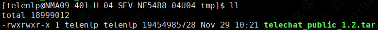
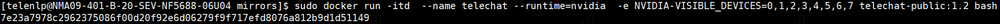
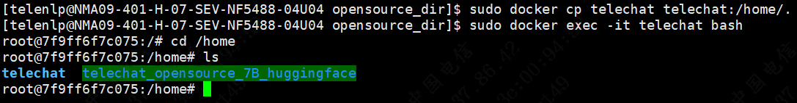
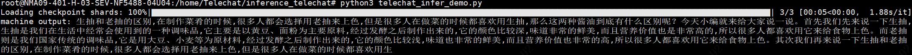
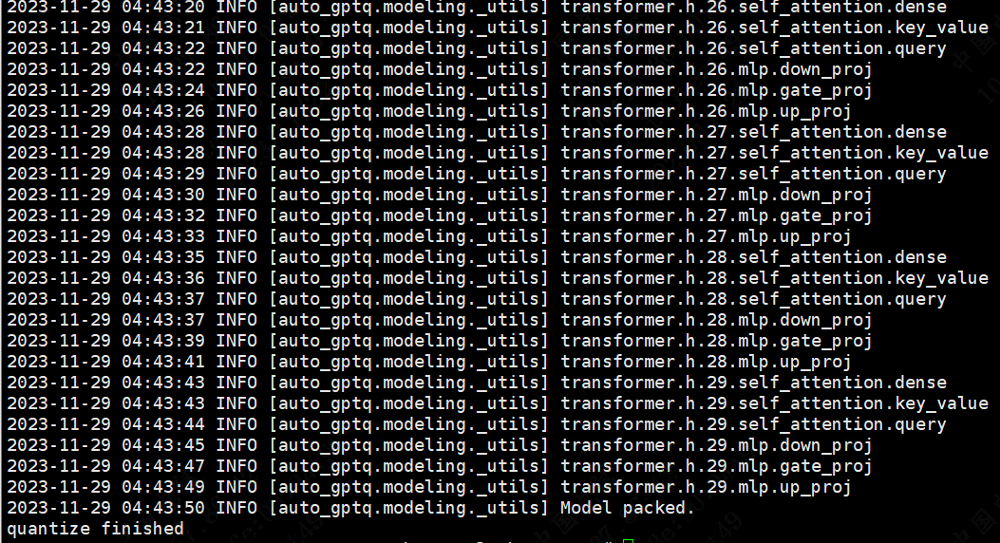
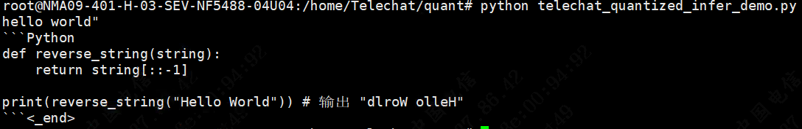
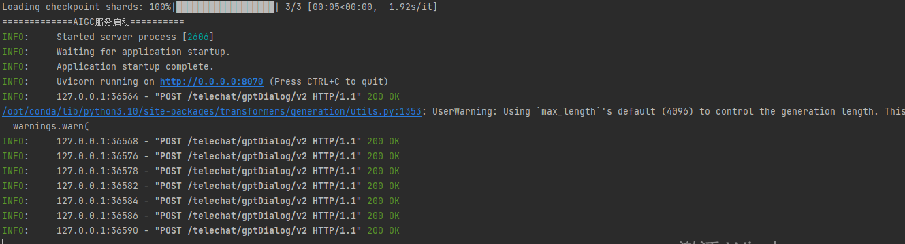
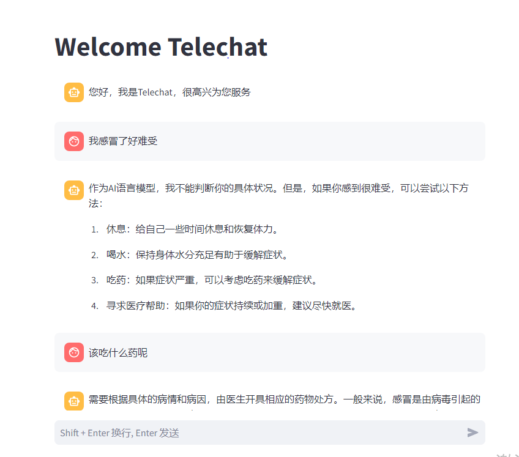

# 快速开始

本教程旨在帮助使用者快速进行Telechat模型的部署开发，主要包括：


## 资源获取


### 镜像下载

为了便于大家快速上手，我们提供了可运行的环境镜像，下载地址：[镜像下载](https://cloud.189.cn/t/EbAriaQfa2mm) （访问码：2uik）

### 模型权重下载


| 模型版本  | 下载链接           |
|---------| ----------------- |
| 7B-FP16 | [TeleChat-FP16](https://huggingface.co/Tele-AI/Telechat-7B) |
| 7B-int8 | [TeleChat-int8](https://huggingface.co/Tele-AI/Telechat-7B-int8) |
| 7B-int4 | [TeleChat-int4](https://huggingface.co/Tele-AI/Telechat-7B-int4) |

## 环境配置


### 镜像开发
**教程中1.2版本为例，后续请修改版本号。**

获取镜像，并完成解压得到tar文件。



导入镜像包

```shell
sudo docker load -i telechat-public_1.2.tar
```


启动容器，其中NVIDIA_VISIBLE_DEVICES=0,1,2,3,4,5,6,7代表挂载编号0-7的8张GPU显卡，请自行修改

```shell
sudo docker run -itd  --name telechat --runtime=nvidia  --shm-size=256g -e NVIDIA_DRIVER_CAPABILITIES=compute,utility  -e NVIDIA_VISIBLE_DEVICES=0,1,2,3,4,5,6,7 telechat-public:1.2 bash
```



复制代码和镜像到容器内

- 例如 复制本地模型文件夹 telechat_opensource_7B_huggingface 到 telechat容器的/home下
- 例如 复制代码文件夹 Telechat 到 telechat容器的/home下

```shell
sudo docker cp telechat_opensource_7B_huggingface telechat:/home/. && sudo docker cp TeleChat telechat:/home/.
```

进入容器

```shell
sudo docker  exec -it telechat bash
```




## 模型推理

进入Telechat/inference_telechat

```shell
python3 telechat_infer_demo.py
```



### 长文外推

我们通过使用NTK-aware外推和attention scaling的方法，能够将在8K长度上微调的模型在推理时外推到96K的长度。下表展示了TeleChat-7B模型在不同长度wikipedia数据上困惑度，可以观察到同时使用NTK-aware外推和attention scaling方法时，TeleChat在96K的推理长度上依然具有较低的困惑度。

|                                    | 2048   | 4096   | 8192    | 16384   | 32768    | 65536    | 98304    |
| ---------------------------------- | ------ | ------ | ------- | ------- | -------- | -------- | -------- |
| baseline                           | 4.8122 | 4.6562 | 39.3099 | 98.3102 | 155.2708 | 487.3398 | 447.6295 |
| NTK-aware (8k)                     | 4.8122 | 4.6562 | 5.1904  | 4.7155  | 8.6351   | 77.7478  | 79.9256  |
| NTK-aware+attention  scaling (8k)  | 4.8122 | 4.6562 | 5.1904  | 4.0353  | 4.1408   | 9.4080   | 7.9711   |
| NTK-aware (16k)                    | 7.6916 | 7.9900 | 7.9580  | 5.1217  | 4.7932   | 10.5444  | 10.3614  |
| NTK-aware+attention  scaling (16k) | 7.6916 | 7.9900 | 7.9580  | 5.1217  | 4.7195   | 8.9751   | 7.6822   |

当然，您也可以在更长的长度上微调TeleChat，使之具备更强的外推能力。微调之后，只需**将模型的`config.json`配置文件中的`training_seqlen`字段修改为微调时的训练长度**即可进行推理。上表的第4、5行展示了将TeleChat-7B在16K长度上微调之后的困惑度，观察到在64K以上的推理长度上具有更低的困惑度。

## 模型微调

模型微调分为全参数微调和lora微调两种方式：

### LoRA微调

**进入`deepspeed-telechat/sft`路径**， 按照下述命令运行，启动基于DeepSpeed LoRA微调。

```shell
bash run_telechat_lora.sh
```

### 全参数微调

**进入`deepspeed-telechat/sft`路径**，按照下述命令运行，启动基于DeepSpeed的全参数微调。

单节点运行脚本

```shell
bash run_telechat_single_node.sh
```

### 微调后推理测试

**进入`inference_telechat/`路径**，修改telechat_infer_demo.py中PATH为上一步保存的模型路径文件，随后，按照下述命令运行，进行模型的推理

```shell
python telechat_infer_demo.py
```

## 模型量化

### GPTQ量化

进入Telechat/quant

```shell
python quant.py
```



### 量化推理

调用推理

```shell
python telechat_quantized_infer_demo.py
```



## 服务化

提供了两种简单的**单并发场景**服务化方式，支持流式返回

### API

进入service 文件夹

```shell
python telechat_service.py
```


默认在0.0.0.0:8070会启动telechat服务,可以使用test_json.py,test_stream.py进行测试

其它机器访问服务，需要修改0.0.0.0为服务机器IP。
### WEB

在完成API部署后，运行

```shell
streamlit run webdemo.py
```


默认在0.0.0.0:8501

其它机器访问服务，需要修改0.0.0.0为服务机器IP。